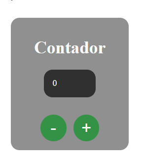
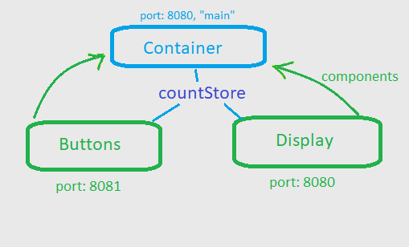

# Projeto "Contador".



### O foco desse projeto é apenas exemplificar o compartilhamento de componentes react e estados globais, através do Module Federation.

<br />

# Começando

Antes de tudo execute o comando para instalar as dependências em cada um dos projetos:

```bash
npm install
# ou
yarn
```

Execute o comando:

```bash
npm run dev
# ou
yarn dev
```

Nos três projetos.

## O que foi usado:

- [Webpack](https://webpack.js.org/)
- [Module Federation](https://webpack.js.org/concepts/module-federation/)
- [React](https://pt-br.reactjs.org/)
- [TypeScript](https://www.typescriptlang.org/)
- [Zustand](https://zustand.surge.sh/)

<br />
<br />

### Resumo:

Um projeto principal, e dois projetos fornecendo componentes.


